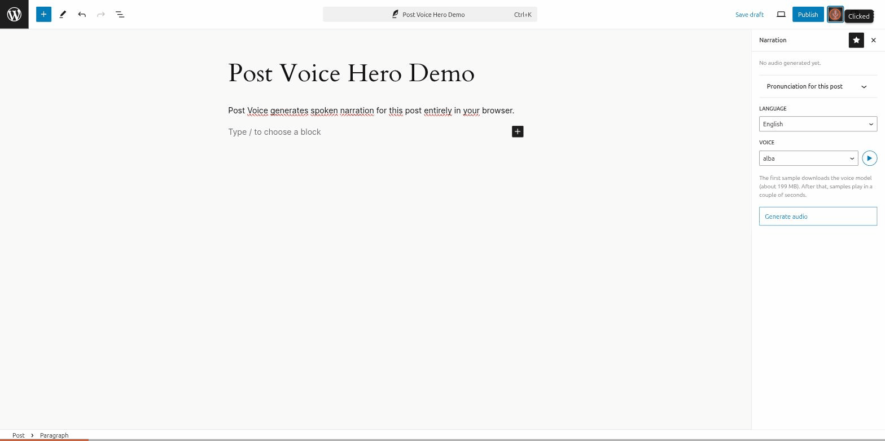
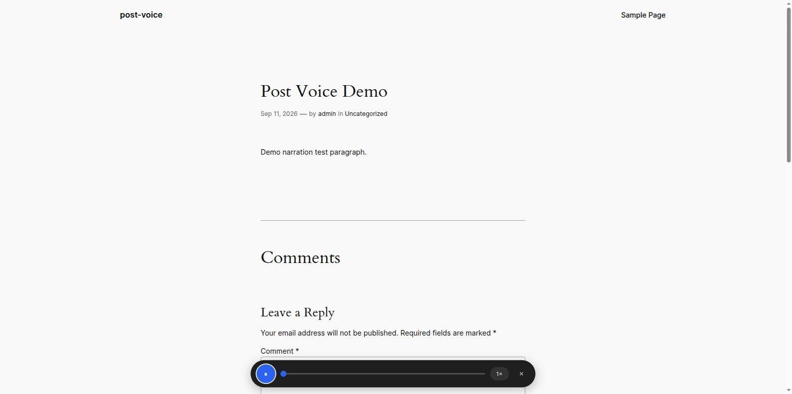

# Post Voice

[](https://github.com/luigi-moretti/post-voice/actions/workflows/ci.yml)
[](LICENSE)

> Narração de posts gerada no navegador do autor — sem TTS no servidor, sem custo por requisição.



## O que é

Post Voice adiciona um painel "Narração" ao editor de blocos do
WordPress. O autor escolhe um idioma, gera o áudio localmente no
navegador (Pocket TTS via ONNX, rodando num Web Worker), confere o
preview e salva. O PHP nunca sintetiza voz — só grava o áudio já pronto
como attachment e registra os metadados do post.

## Recursos

- Painel de Narração no editor de blocos
- Player flutuante no front-end para os leitores
- Dicionário de pronúncia — corrige como palavras específicas são lidas
- Customização do estilo do player (tela de admin)



## Requisitos

- WordPress 6.6+
- PHP 8.2+
- HTTPS — Web Crypto API e AudioWorklet só funcionam em contexto seguro
- Chrome recente (testado); outros navegadores modernos devem funcionar
  mas rodam em modo single-thread mais lento, sem garantia formal ainda
- A primeira geração de narração baixa cerca de 190MB de modelo de voz
  para o armazenamento do navegador. Fica em cache depois disso, então
  gerações seguintes não baixam de novo.

## Usar em um site

Ainda não está no WordPress.org. Pra instalar:

1. Baixe o zip da [última release](https://github.com/luigi-moretti/post-voice/releases/latest).
2. No admin do WordPress: **Plugins → Add New → Upload Plugin**.
3. Selecione o zip baixado, instale e ative.

## Contribuir

```bash
git clone <seu-fork>
cd post-voice
npm ci
composer install
npx wp-env start
npm run build
```

Fluxo completo de contribuição (fork, PR, checklist de gates, convenção
de commit): [`CONTRIBUTING.md`](CONTRIBUTING.md).

## Docs

- [`docs/adr/`](docs/adr/README.md) — decisões de arquitetura
- [Spec do MVP](docs/superpowers/specs/2026-08-08-wp-narration-plugin-mvp-design.md)
- [`TESTING.md`](TESTING.md) — como rodar cada gate

## Licença

GPL-2.0-or-later — ver [`LICENSE`](LICENSE). Código de terceiros vendored
está documentado em [`CREDITS.md`](CREDITS.md). Regras de conduta da
comunidade: [`CODE_OF_CONDUCT.md`](CODE_OF_CONDUCT.md). Para reportar uma
vulnerabilidade de segurança: [`SECURITY.md`](SECURITY.md).
