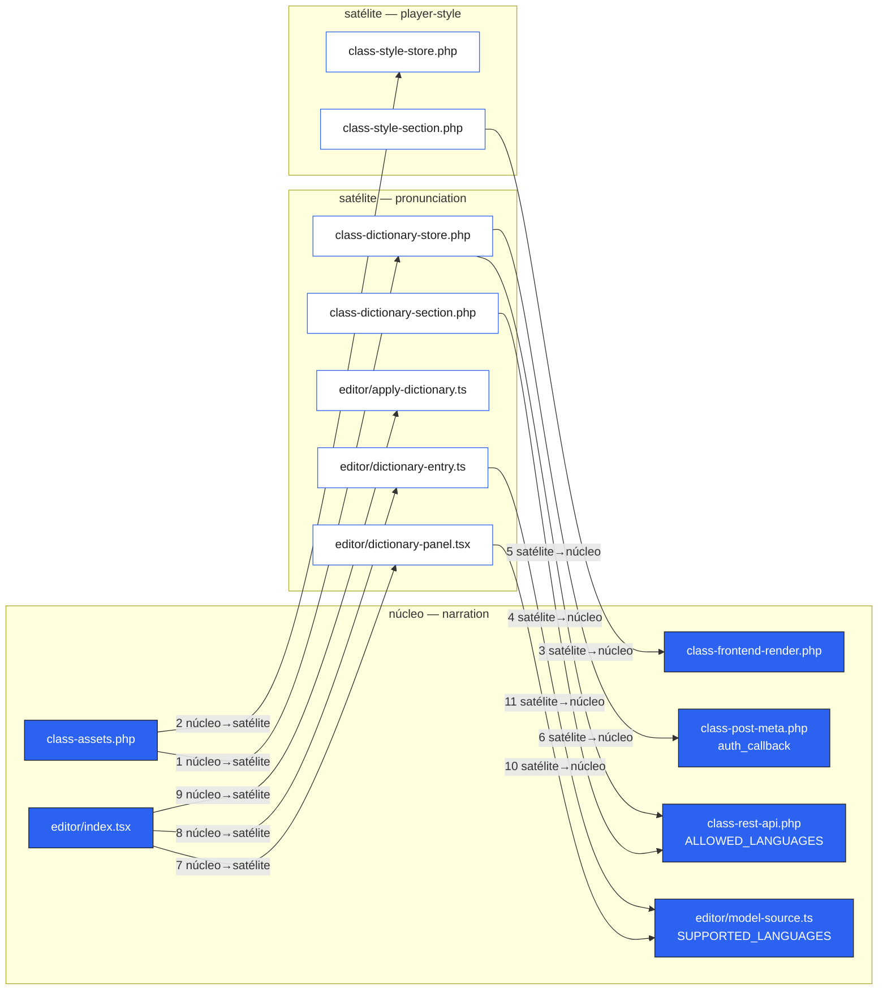
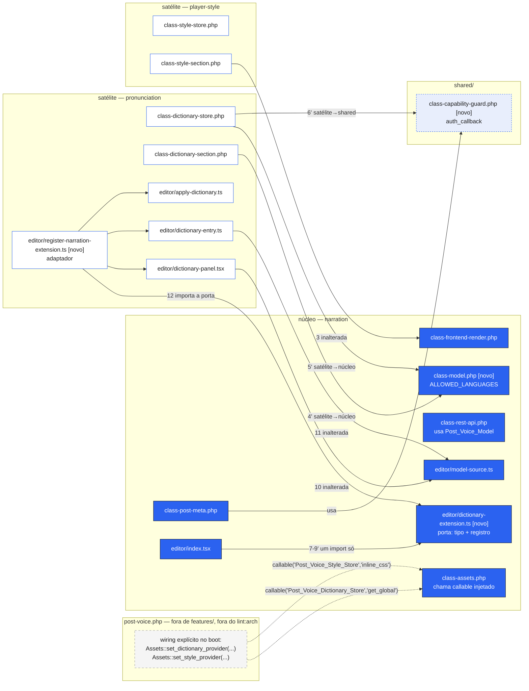
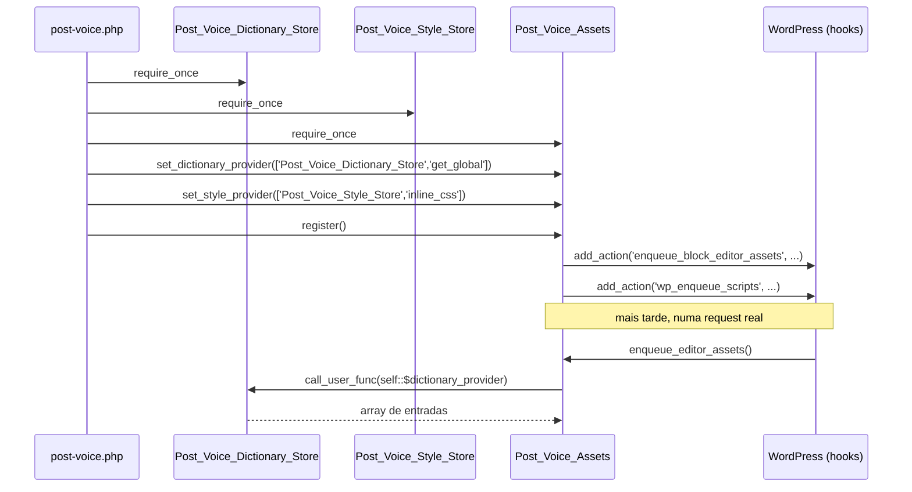

# Topologia núcleo+extensões — mecanismo de extensão para ADR-0005

**Data:** 2026-09-11
**Status:** Implementado — branch `docs/topologia-nucleo-extensoes-design`
**Origem da reabertura:** dívida técnica acumulada, sem requisito de produto novo
puxando (ver "Gatilho", abaixo).

## Contexto

A ADR-0005 (`docs/adr/0005-topologia-de-dependencia-entre-features.md`) já
descreve a forma real do sistema — `narration` é núcleo (5/10 classes PHP,
~24/33 módulos TS), `pronunciation` e `player-style` são extensões que não
fazem sentido sozinhas — e já rejeitou trocar o layout de pastas
(`features/` → `core/`+`extensions/`) porque o problema nunca foi o nome da
pasta: é a regra de dependência que faltava. Isso continua verdadeiro e este
spec não revisita essa parte.

O que a ADR-0005 deixou em aberto, de propósito, foi **como** o núcleo
publica um ponto de extensão. A seção "Saída conhecida" da própria ADR mediu
o custo de inverter as cinco arestas núcleo→satélite (1, 2, 7, 8, 9) e
recomendou **não inverter agora**, porque nada no projeto exigia `narration`
rodando com as extensões desligadas. O `docs/research/2026-08-27-custo-inversao-arestas-cross-feature.md`
tem o detalhamento por mecanismo; este spec parte dele.

### Gatilho

Perguntei diretamente: o que mudou desde 27/08 que justifica reabrir? Resposta:
nada de concreto. Não há plano firme de um segundo engine TTS nem de
traduções publicadas em outro idioma além do inglês — e mesmo que houvesse,
nenhum dos dois pressiona **esta** topologia especificamente:

- Trocar de engine TTS já tem isolamento próprio, decidido em ADR-0003
  (*"a costura de engine fica isolada em `editor/engine/`"*) — ortogonal a
  `narration`↔`pronunciation`↔`player-style`.
- Traduções reais (`.po`/`.mo`) são conteúdo; ADR-0010 já garante que toda
  string passa por gettext. Não mudam quem depende de quem entre features.

A justificativa real é pagar a dívida por ela mesma, agora que há espaço na
branch — o que a ADR-0005 já previa como saída válida ("Se esse requisito
aparecer, a ordem é..."), só que a ordem aqui não é "requisito apareceu", é
"decisão deliberada de investir". Isso é dito explicitamente porque muda o
que este spec pode prometer: não há orçamento pra pagar o mecanismo mais caro
(sub-opção B, bundle webpack novo) sem um requisito que o justifique — ver
"Não-metas".

## Decisões fechadas

| Decisão | Escolha | Por quê |
|---|---|---|
| Layout de pastas | Mantém `features/` | Reafirma ADR-0005; nenhum fato novo desde 27/08 muda essa conta |
| Mecanismo para arestas núcleo→satélite em PHP (1, 2) | Injeção explícita de dependência (callable-string) no bootstrap, **não** filtro `apply_filters` | Filtro é registro global por string — qualquer tema/plugin de terceiro pode hookar sem saber do projeto; DI no bootstrap fica fechada por padrão, só o próprio `post-voice.php` decide quem provê a porta |
| Mecanismo para arestas núcleo→satélite em TS (7, 8, 9) | Consolidar em um módulo de porta+registro (sub-opção A do research doc), mantendo import direto | Sub-opção B (bundle webpack separado + `@wordpress/hooks`) tem o mesmo problema do filtro PHP — registro global de string, alcançável por qualquer script na página — e nenhum requisito hoje justifica pagar um segundo entry point de build |
| Arestas 4, 5 (`ALLOWED_LANGUAGES`) | Mover a constante de `Post_Voice_Rest_Api` (classe de transporte HTTP) para uma classe de domínio nova em `narration` | Corrige uma imprecisão real, já apontada no research doc; direção da aresta não muda (satélite lê núcleo já é a direção correta) |
| Aresta 6 (`auth_callback`) | Mover para `shared/` | Já tem dois consumidores reais hoje (`Post_Voice_Post_Meta`, `Post_Voice_Dictionary_Store`) — a própria regra `shared-two-consumers` da ADR-0004 pede isso |
| Arestas 3, 10, 11 | Inalteradas | Já apontam satélite→núcleo, a direção correta; mexer custa (research doc: aresta 3 recriaria o anti-padrão ao contrário; 10/11 tocariam 8 arquivos de `narration` por zero ganho) |
| Governança | ADR nova (0016) registra o mecanismo de DI explícita como padrão do projeto para resolver arestas núcleo→satélite; ADR-0005 mantém `status: aceita-com-desvio`, com `desvios:` editado | Corpo da ADR-0005 (seção "Saída conhecida") afirma "não inverter agora" — mudar essa afirmação é mudar de ideia, e ADR não se edita nesse campo (ADR-0001, "quem pode mudar o quê") |

## Estado atual medido (reconfirmado)

As onze arestas, como o research doc já catalogou — reproduzido aqui porque é
o "antes" que o resto do documento transforma:

| # | De | Para | Sentido | Ação neste spec |
|---|---|---|---|---|
| 1 | `narration/php/class-assets.php` | `Post_Voice_Dictionary_Store::get_global()` | núcleo→satélite | **resolvida** (DI) |
| 2 | `narration/php/class-assets.php` | `Post_Voice_Style_Store::inline_css()` | núcleo→satélite | **resolvida** (DI) |
| 3 | `player-style/php/class-style-section.php` | `Post_Voice_Frontend_Render::markup()` | satélite→núcleo | inalterada |
| 4 | `pronunciation/php/class-dictionary-section.php` | `Post_Voice_Rest_Api::ALLOWED_LANGUAGES` | satélite→núcleo | renomeada (→ `Post_Voice_Model`) |
| 5 | `pronunciation/php/class-dictionary-store.php` | `Post_Voice_Rest_Api::ALLOWED_LANGUAGES` | satélite→núcleo | renomeada (→ `Post_Voice_Model`) |
| 6 | `pronunciation/php/class-dictionary-store.php` | `Post_Voice_Post_Meta::auth_callback` | satélite→núcleo | **resolvida** (`shared/`) |
| 7 | `narration/editor/index.tsx` | `pronunciation/editor/dictionary-panel` | núcleo→satélite | consolidada (com 8, 9) |
| 8 | `narration/editor/index.tsx` | `pronunciation/editor/dictionary-entry` | núcleo→satélite | consolidada (com 7, 9) |
| 9 | `narration/editor/index.tsx` | `pronunciation/editor/apply-dictionary` | núcleo→satélite | consolidada (com 7, 8) |
| 10 | `pronunciation/editor/dictionary-panel.tsx` | `narration/editor/model-source` | satélite→núcleo | inalterada |
| 11 | `pronunciation/editor/dictionary-entry.ts` | `narration/editor/model-source` | satélite→núcleo | inalterada |

**Correção feita durante a execução do plano (Task 4):** o adaptador
`register-narration-extension.ts` (produção, em `pronunciation`) precisa
importar `registerDictionaryExtension` de `narration/editor/dictionary-extension`
para se registrar — satélite→núcleo, a direção correta, mas ainda uma aresta
nova pela regra mecânica de `feature-deps`, que a tabela acima não contava.
Chame-a de **aresta 12**: `pronunciation/editor/register-narration-extension.ts
→ narration/editor/dictionary-extension`, satélite→núcleo, mesma categoria de
3/10/11 (custo já aceito, sem indireção nova). O saldo abaixo já reflete essa
correção.

Saldo: **11 → 7** entradas em `desvios:` na ADR-0005 (3 resolvidas de verdade:
1, 2, 6; três consolidadas em uma: 7-8-9 → 1; duas renomeadas mas presentes:
4, 5; três sem mudança: 3, 10, 11; mais a aresta 12, nova e aceita pela mesma
razão de 3/10/11).

## Arquitetura

### Antes — grafo de dependência cross-feature



Onze arestas, cinco na direção errada (núcleo lendo satélite: 1, 2, 7, 8, 9),
formando os dois ciclos `narration ↔ pronunciation` e `narration ↔ player-style`.

### Depois — grafo de dependência



Note o que sumiu: nenhuma seta cruza de `Assets2` para dentro de `pron2`/`style2`
— a linha pontilhada de `Wire` nasce em `post-voice.php`, fora de `features/`,
fora do que `feature-deps` varre. O import de `IndexTsx2` cai de três símbolos
nomeados (`DictPanel`, `DictEntry`+`mergeDictionaries`, `applyDictionary`)
para um módulo só (`Port`), que é dono da própria feature — não é mais aresta
pra três destinos diferentes, é uma aresta pra um.

## Mecanismo 1 — DI explícita para arestas 1 e 2 (PHP)

### Antes

```php
// features/narration/php/class-assets.php
wp_localize_script(
    'post-voice-editor',
    'postVoiceData',
    array(
        'dictionary' => Post_Voice_Dictionary_Store::get_global(),
        // ...
    )
);
// ...
$inline = Post_Voice_Style_Store::inline_css();
```

### Depois

```php
// features/narration/php/class-assets.php
class Post_Voice_Assets {

    /** @var callable|null */
    private static $dictionary_provider;

    /** @var callable|null */
    private static $style_provider;

    /**
     * Porta: quem injeta decide de onde vem o dicionário global. Assinatura
     * exigida: () => array<{term,replacement,language}>.
     */
    public static function set_dictionary_provider( callable $provider ): void {
        self::$dictionary_provider = $provider;
    }

    /**
     * Porta: quem injeta decide de onde vem o CSS inline do player.
     * Assinatura exigida: () => string.
     */
    public static function set_style_provider( callable $provider ): void {
        self::$style_provider = $provider;
    }

    // enqueue_editor_assets() e enqueue_frontend_assets() chamam
    // call_user_func( self::$dictionary_provider ) e
    // call_user_func( self::$style_provider ) em vez do símbolo direto.
}
```

```php
// post-voice.php — único lugar que conhece as duas pontas
require_once POST_VOICE_PATH . 'features/pronunciation/php/class-dictionary-store.php';
require_once POST_VOICE_PATH . 'features/player-style/php/class-style-store.php';
require_once POST_VOICE_PATH . 'features/narration/php/class-assets.php';

Post_Voice_Assets::set_dictionary_provider( array( 'Post_Voice_Dictionary_Store', 'get_global' ) );
Post_Voice_Assets::set_style_provider( array( 'Post_Voice_Style_Store', 'inline_css' ) );
Post_Voice_Assets::register();
```

### Sequência de boot



### Por que não é `interface` PHP

O projeto não usa `interface` em lugar nenhum hoje (`grep` confirma zero
declarações). Introduzir a palavra-chave criaria um idioma novo sem
precedente, e nomenclatura de arquivo pra interface não está coberta pela
regra `php-class-naming` (ADR-0006, que fala só de `class`). A porta aqui é
um **callable com assinatura documentada em docblock**, o mesmo idioma que a
aresta 6 já usa hoje (`array( 'Post_Voice_Post_Meta', 'auth_callback' )`
como callable-string) — generalizar um padrão já em produção custa menos
review que introduzir um novo.

### Falha, deliberadamente ruidosa

`self::$dictionary_provider` não tem valor padrão. Se `post-voice.php`
esquecer o `set_dictionary_provider()`, `call_user_func( null )` lança
`TypeError` — fatal, imediato, no boot. Isso é a mesma classe de falha que o
projeto já tem hoje (remover `pronunciation/` sem atualizar `class-assets.php`
já é fatal error) e é o oposto deliberado do que um filtro WP teria dado
(retorno vazio silencioso). Não há guarda de "se nulo, retorna array vazio" —
isso reintroduziria o modo de falha silenciosa que este mecanismo existe pra
evitar.

## Mecanismo 2 — relocação de `ALLOWED_LANGUAGES` (arestas 4, 5)

Nova classe `features/narration/php/class-model.php`:

```php
class Post_Voice_Model {
    public const ALLOWED_LANGUAGES = array( 'english_2026-04', 'german', 'italian', 'portuguese', 'spanish' );
}
```

`class-rest-api.php` e `class-post-meta.php` passam a referenciar
`Post_Voice_Model::ALLOWED_LANGUAGES` (dentro da própria feature, sem custo).
`class-dictionary-section.php` e `class-dictionary-store.php` (pronunciation)
trocam `Post_Voice_Rest_Api::ALLOWED_LANGUAGES` por
`Post_Voice_Model::ALLOWED_LANGUAGES` — a aresta continua existindo (satélite
lê núcleo), só que agora aponta pro dono certo do dado. `ADR-0005`'s
`desvios:` troca as duas linhas de chave:

```yaml
desvios:
  - features/pronunciation/php/class-dictionary-section.php → Post_Voice_Model
  - features/pronunciation/php/class-dictionary-store.php → Post_Voice_Model
```

4 arquivos tocados, 0 arquivo de teste (nenhum referencia o símbolo pelo
nome — já medido no research doc), sem mudança de comportamento.

## Mecanismo 3 — `auth_callback` para `shared/` (aresta 6)

Nova classe `shared/php/class-capability-guard.php`:

```php
class Post_Voice_Capability_Guard {
    public static function auth_callback( $allowed, $meta_key, $post_id ): bool {
        return current_user_can( 'edit_post', $post_id );
    }
}
```

`class-post-meta.php` remove o método próprio e chama
`array( 'Post_Voice_Capability_Guard', 'auth_callback' )`.
`class-dictionary-store.php` (pronunciation) troca a string-callable de
`'Post_Voice_Post_Meta'` para `'Post_Voice_Capability_Guard'`. `shared/`
nunca conta como aresta (a regra `feature-deps` já exclui `donos.feature ===
'shared'`) — a entrada some de `desvios:` na ADR-0005. `post-voice.php` ganha
um `require_once` novo, posicionado antes de `class-post-meta.php` e
`class-dictionary-store.php`. Teste
`test-post-meta.php::test_auth_callback_requires_edit_post_capability` migra
para `shared/tests/php/test-capability-guard.php` (o método sai da classe
original, o teste antigo pararia de compilar).

## Mecanismo 4 — porta consolidada no editor (arestas 7, 8, 9)

### Antes

```ts
// features/narration/editor/index.tsx
import { DictionaryPanel } from '../../pronunciation/editor/dictionary-panel';
import type { DictionaryEntry } from '../../pronunciation/editor/dictionary-entry';
import { mergeDictionaries } from '../../pronunciation/editor/dictionary-entry';
import { applyDictionary } from '../../pronunciation/editor/apply-dictionary';
```

### Depois

```ts
// features/narration/editor/dictionary-extension.ts [novo] — a porta
import type { ComponentType } from 'react';
import type { DictionaryEntry } from '../../pronunciation/editor/dictionary-entry';

export interface DictionaryExtension {
    Panel: ComponentType< DictionaryPanelProps >;
    mergeDictionaries: ( a: DictionaryEntry[], b: DictionaryEntry[] ) => DictionaryEntry[];
    applyDictionary: ( text: string, entries: DictionaryEntry[] ) => string;
}

let extension: DictionaryExtension | null = null;

export function registerDictionaryExtension( ext: DictionaryExtension ): void {
    extension = ext;
}

export function getDictionaryExtension(): DictionaryExtension | null {
    return extension;
}
```

```ts
// features/pronunciation/editor/register-narration-extension.ts [novo] — o adaptador
import { registerDictionaryExtension } from '../../narration/editor/dictionary-extension';
import { DictionaryPanel } from './dictionary-panel';
import { mergeDictionaries } from './dictionary-entry';
import { applyDictionary } from './apply-dictionary';

registerDictionaryExtension( { Panel: DictionaryPanel, mergeDictionaries, applyDictionary } );
```

```ts
// features/narration/editor/index.tsx
import { getDictionaryExtension } from './dictionary-extension';
import './register-dictionary-extension-side-effect'; // ver nota abaixo
```

**O limite físico permanece** (já medido no research doc): `index.tsx` é o
único entry webpack, não existe composition root em runtime JS acima dele.
Algo dentro do bundle ainda precisa importar o módulo que chama
`registerDictionaryExtension()` — na prática, `index.tsx` mantém **um**
import relativo pra dentro de `pronunciation/editor/`, de efeito colateral,
em vez de quatro símbolos nomeados de três módulos diferentes. É consolidação,
não eliminação — a mesma conclusão da sub-opção A do research doc, só que
agora com uma porta tipada (`DictionaryExtension`) em vez de um objeto
implícito. `ADR-0005`'s `desvios:` troca três linhas por uma:

```yaml
desvios:
  - features/narration/editor/index.tsx → pronunciation/editor/register-narration-extension
```

## Impacto na governança de ADR

| ADR | Mudança | Como |
|---|---|---|
| 0005 | `desvios:` editado (11 → 7 entradas, ver tabela acima) | Campo vivo — qualquer PR muda, sem ADR nova. `status` permanece `aceita-com-desvio` |
| 0004 | Nenhuma mudança de texto; ganha um consumidor a mais em `shared/` (`class-capability-guard.php`, dois consumidores reais desde o dia 1) | Nenhuma — a regra `shared-two-consumers` já cobre isso |
| **0016 (nova)** | Registra o mecanismo — DI explícita via callable no bootstrap é como o núcleo publica uma porta pra uma extensão em PHP; import único consolidado é o equivalente em TS; filtro `apply_filters`/`@wordpress/hooks` fica reservado pro dia em que existir um requisito real de compatibilidade externa | Nova ADR — a ADR-0005 não pode ser reescrita pra dizer "inverter agora" quando o texto atual diz o oposto (ADR-0001: Contexto/Decisão/Consequências são imutáveis) |

A ADR-0016 é o que passa nos dois testes de admissão (ADR-0001): orienta
código que ainda não foi escrito (a próxima aresta núcleo→satélite que
alguém precisar resolver usa este mecanismo, não reinventa), e reverter custa
mais que um PR (é o padrão de extensão do projeto inteiro, não uma escolha
isolada). `enforced_by` provável: `review-manual` — não há regex razoável
que distinga "DI explícita" de "acoplamento direto disfarçado de DI"; o que
`feature-deps` já verifica (a aresta não pode crescer) continua sendo a
âncora mecânica.

## Escopo

Entra:

- `features/narration/php/class-assets.php`, `class-model.php` (novo)
- `features/narration/editor/dictionary-extension.ts` (novo)
- `features/pronunciation/php/class-dictionary-store.php`, `class-dictionary-section.php`
- `features/pronunciation/editor/register-narration-extension.ts` (novo)
- `shared/php/class-capability-guard.php` (novo)
- `features/narration/php/class-post-meta.php`
- `post-voice.php` (wiring)
- `docs/adr/0005-topologia-de-dependencia-entre-features.md` (`desvios:`)
- `docs/adr/0016-*.md` (nova)
- Testes PHP e Jest tocados pelas relocações (ver cada mecanismo acima)

Não entra:

- Arestas 3, 10, 11 — sem ganho medido, custo real (ver tabela "Decisões fechadas")
- Sub-opção B (bundle webpack separado + `@wordpress/hooks`) — sem requisito que pague o custo
- Qualquer trabalho de multi-engine TTS ou i18n de conteúdo — servem de contexto, não de escopo (ver "Gatilho")
- Mudança de layout de pastas — ADR-0005 já decidiu, este spec reafirma

## Testes

- PHP: `test-assets.php` ganha casos para `set_dictionary_provider`/
  `set_style_provider` não configurados (deve lançar) e configurados (deve
  chamar o callable). `test-post-meta.php` perde o teste de `auth_callback`,
  que migra para `shared/tests/php/test-capability-guard.php`. Testes de
  `ALLOWED_LANGUAGES` continuam passando sem edição (usam strings literais,
  não o símbolo).
- Jest: nenhum teste novo estritamente necessário para a consolidação de
  imports — `dictionary-entry.test.ts` e `apply-dictionary.test.ts`
  continuam cobrindo as funções puras. **Lacuna pré-existente que este spec
  não fecha:** não existe teste Jest para `dictionary-panel.tsx` nem para o
  wiring de registro — só e2e cobre isso hoje, e continua assim depois.
- `npm run lint:arch`: critério de aceite principal — roda limpo com o
  `desvios:` novo (7 entradas) e falha se qualquer uma das entradas
  resolvidas (1, 2, 6) ainda aparecer no código.
- `npm run doctor`: confirma dívida quitada nas 3 entradas resolvidas.

## Riscos

- **`call_user_func` sobre um callable-string erra em silêncio se o nome do
  método mudar** (ex.: renomear `get_global` sem atualizar o `post-voice.php`)
  — PHP não valida a assinatura em tempo de wiring, só na chamada. Mitigado
  por ser fatal (não silencioso) e pelo teste de `test-assets.php` que
  exercita o caminho.
- **A porta TS (`DictionaryExtension`) pode divergir da interface real** de
  `DictionaryPanel` se um dos dois for editado sem o outro — TypeScript
  pega isso em `tsc --noEmit` (gate já no fluxo pré-PR), então o risco é
  baixo, mas vale nomear.
- **`class-model.php` é uma classe nova de uma linha** — pode parecer
  over-engineering. Aceito porque corrige a imprecisão real (dado de domínio
  numa classe de transporte HTTP) que o research doc já apontava, independente
  de qualquer decisão sobre as arestas caras.

## Critérios de aceite

1. `npm run lint:arch` passa, com `docs/adr/0005-*.md`'s `desvios:` contendo
   exatamente as 7 entradas da tabela "Estado atual medido".
2. Nenhum arquivo sob `features/**/*.php` ou `features/**/*.{ts,tsx}`
   contém, textualmente, `Post_Voice_Dictionary_Store`, `Post_Voice_Style_Store`
   fora da própria feature `pronunciation`/`player-style`, nem
   `pronunciation/editor/dictionary-panel` etc. importado fora de
   `register-narration-extension.ts`.
3. `docs/adr/0016-*.md` existe, passa nos dois testes de admissão da
   ADR-0001, e `npm run doctor` não acusa `origem` quebrada.
4. `composer run stan` e `npx tsc --noEmit` passam com os tipos novos
   (`Post_Voice_Capability_Guard`, `DictionaryExtension`).
5. `npm run test:php` e `npm run test:unit` passam, incluindo os testes
   migrados/novos listados em "Testes".
6. Remover `pronunciation/` do `post-voice.php` (manualmente, num teste
   manual de review) continua produzindo fatal error imediato — não
   degradação silenciosa.

## Não-metas explícitas

- **Inverter as arestas 3, 10, 11.** Sem ganho medido; ver research doc.
- **Sub-opção B para 7-9 (bundle webpack + `@wordpress/hooks`).** Sem
  requisito que pague o custo — fica documentado como próximo passo na
  ADR-0016 caso um requisito real apareça (`narration` precisar rodar com
  extensões desligadas).
- **Migrar layout de pastas para `core/`+`extensions/`.** Decidido e
  rejeitado na ADR-0005; nada neste spec reabre essa parte.
- **Suporte a múltiplos engines TTS.** Contexto de design, não escopo — vira
  spec própria se/quando houver plano concreto.
- **Traduções reais além do inglês.** Idem — conteúdo, não arquitetura.
